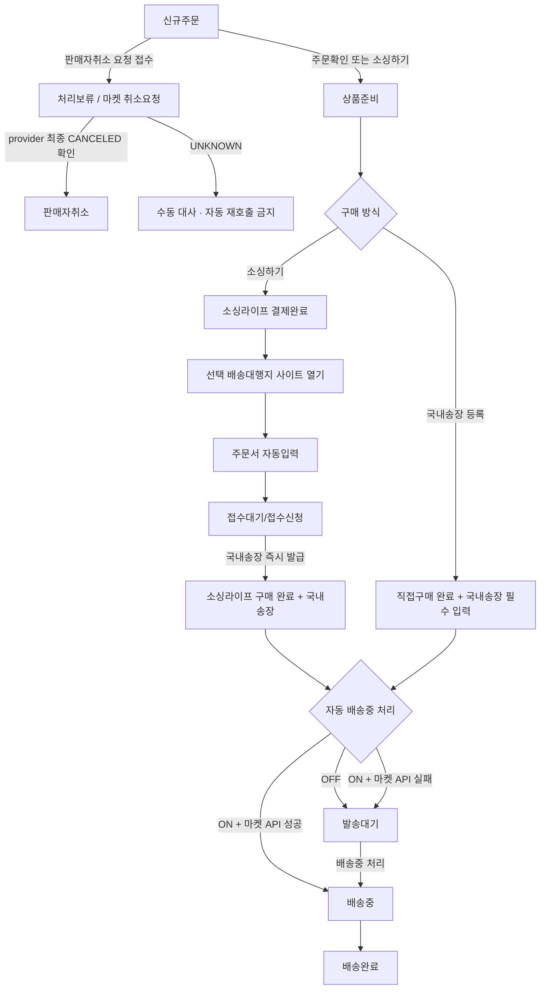
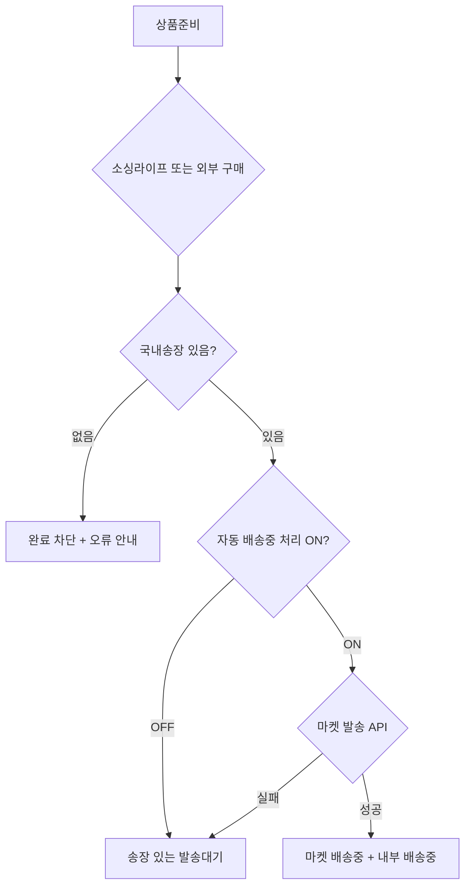
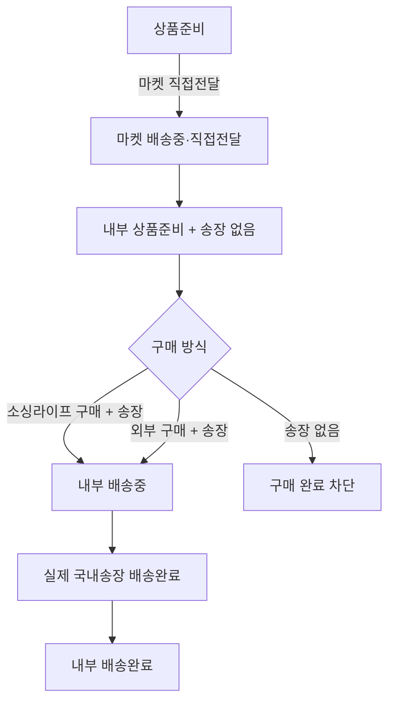
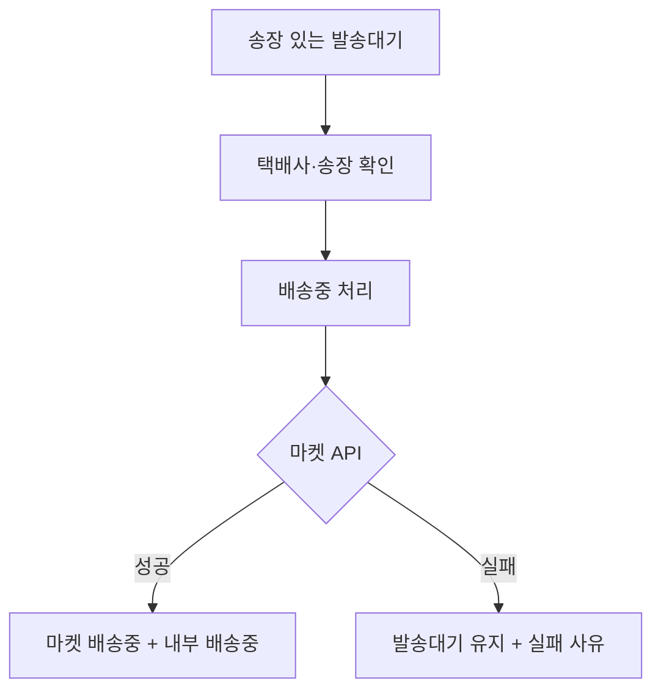

# 주문처리 유저플로우

상태 전환의 최종 기준은 `docs/00_문서맵/01_주문처리_핵심규칙.md`를 따른다.

## 1. 기본 흐름

## 2. 상태별 액션

| 상태 | 화면 | 사용자 액션 | 결과 |
|---|---|---|---|
| `NEW` | 신규주문 | `주문확인` | `PREPARING` |
| `NEW` | 신규주문 | `소싱하기` | 매칭 저장 후 `PREPARING` |
| `NEW` | 신규주문 | `주문취소` | 접수 성공 시 `ON_HOLD / CANCEL_REQUESTED`, 최종 확인 후 `CANCELED` |
| `PREPARING` | 상품준비 | `소싱하기` | 결제 → 배대지 주문서 자동입력·접수 → 국내송장 즉시 발급 후 자동 설정에 따라 `READY_TO_SHIP` 또는 `SHIPPING` |
| `PREPARING` | 상품준비 | `국내송장 등록` | 직접구매 택배사·송장 필수 저장 후 자동 설정에 따라 `READY_TO_SHIP` 또는 `SHIPPING` |
| `PREPARING` | 상품준비 | `마켓 직접전달` | 마켓 배송중, 내부는 구매 완료 전까지 `PREPARING` |
| `READY_TO_SHIP` | 발송대기 | `배송중 처리` | 마켓 API 성공 후 `SHIPPING` |
| `SHIPPING` | 배송중 | 조회 | 실제 국내배송 진행 확인 |
| `DELIVERED` | 배송완료 | 조회 | 배송완료·구매확정 확인 |

신규주문의 소싱하기 모달에서는 `주문확인` 아래 `주문취소`를 선택할 수 있다. 주문취소를 누르면 매칭을 저장하지 않고 공통 판매자 주문취소 확인 모달로 전환한 뒤 위 `NEW → ON_HOLD / CANCEL_REQUESTED → CANCELED` 흐름을 따른다.
| `ON_HOLD` | 전체주문 | 조회·수동 대사 | 일반 처리 액션과 판매자취소 재호출 차단 |
| `CLAIM` | 취소/반품/교환 | 클레임 액션 | 마켓별 처리 결과 반영 |

## 3. 구매 완료 분기

소싱라이프 구매와 외부 구매 모두 국내송장이 필수다. 소싱라이프 연결 배송대지는 접수 성공과 동시에 송장을 발급하며 `접수대기`와 `접수신청`은 같은 단계다. `구매 안 함` 흐름은 없다.

## 4. 직접전달 선처리 분기

직접전달은 마켓 발송 방식이며 구매를 대체하지 않는다. 직접전달 주문의 실제 국내송장은 마켓에 다시 전송하지 않고 내부 배송 추적에 사용한다.

## 5. 발송대기 처리

발송대기에는 구매와 국내송장 저장이 완료된 주문만 들어간다.

송장 없음 필터와 소싱라이프 송장 수집 버튼은 제공하지 않는다.

## 6. 금지 흐름

- 배송대행지 정상 접수 후 장기 송장 대기
- 외부 구매 완료 후 송장 대기
- 직접전달 후 구매 없이 송장만 저장
- 직접전달 후 송장 없는 구매 완료
- 구매 안 함 처리

## 7. 화면 이동

| 출발 | 행동 | 도착 또는 결과 |
|---|---|---|
| 주문수집 | 상단 탭 선택 | 신규주문, 상품준비, 발송대기, 배송중, 배송완료 |
| 신규주문 | `소싱하기` | 소싱 매칭 모달 |
| 상품준비 | `소싱하기` | 상품·옵션 및 배대지 수령 프로필 선택 |
| 상품준비 | `구매대행 신청` | 결제대기·채팅 화면(결제 미실행) |
| 결제대기 | `결제하기` | 별도 결제 화면 |
| 결제 화면 | `결제 완료` | 선택 배송대행지 사이트 열기 → 주문서 자동입력 → 접수 → 국내송장 즉시 발급 → 결제완료·채팅 화면 |
| 결제완료 | `결제완료 보기` | 신청·결제정보와 소싱라이프 채팅 조회(재결제 불가) |
| 상품준비 | `국내송장 등록` | 직접구매 택배사·국내송장 입력 모달 |
| 발송대기 | `배송중 처리` | 마켓 API 성공 후 배송중 |
| 자세히 보기 > 처리하기 | `결제완료 보기` | 결제정보·채팅 모달(재결제 불가) |

목록 처리하기는 단계별 고빈도 액션만 표시한다. 상품준비의 `국내송장 등록`, `마켓 직접전달`과 발송대기의 `결제완료 보기`, `주문취소`는 자세히 보기의 처리하기에서 실행한다. 직접전달 주문에는 `주문취소`를 표시하지 않는다.

중국배송중·통관 중·국내 배송중은 진행상태 배지로만 확인하며 별도 보기 버튼이나 모달을 제공하지 않는다.

`결제하기`는 상품준비의 결제대기에서만 노출한다. 발송대기·배송중·배송완료는 결제완료 또는 외부구매 완료를 선행조건으로 하며, 미결제 조합은 배송 처리 없이 `결제상태 불일치`로 분리한다.

현재 프로토타입은 배송대행지 사이트 열기·자동입력·접수 단계를 표시하지 않고 결제완료 클릭 시 더미 국내송장을 즉시 생성한다. 자동 배송중 처리 ON은 마켓 전송 성공을 로컬 상태로 시뮬레이션하고, OFF는 마켓 상태를 변경하지 않은 발송대기로 이동한다.
