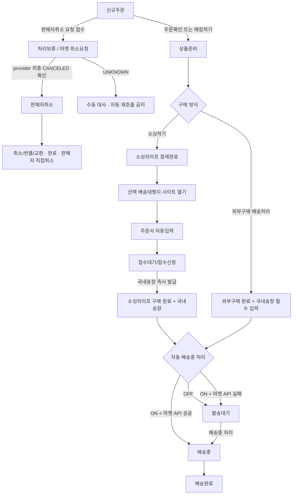
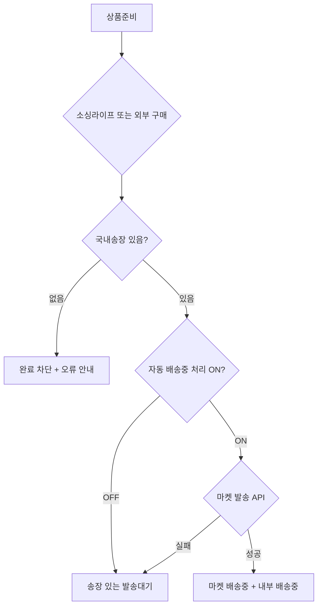
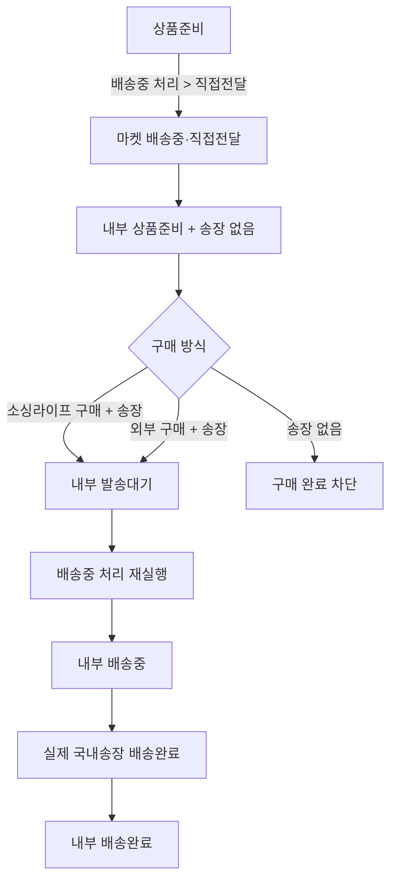
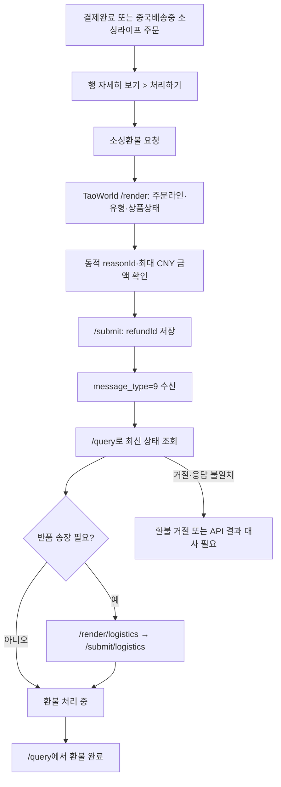

# 주문처리 유저플로우

상태 전환의 최종 기준은 `docs/00_문서맵/01_주문처리_핵심규칙.md`를 따른다.

## 1. 기본 흐름

## 2. 상태별 액션

| 상태 | 화면 | 사용자 액션 | 결과 |
|---|---|---|---|
| `NEW` | 신규주문 | `주문확인` | `PREPARING` |
| `NEW` | 신규주문 | `매칭하기` | 매칭 저장 후 `PREPARING` |
| `NEW` | 신규주문 | `주문취소` | 접수 성공 시 `ON_HOLD / CANCEL_REQUESTED`, 최종 확인 후 `CANCELED` |
| `PREPARING` | 상품준비 | `소싱하기` | 결제 성공 즉시 내부 `SHIPPING` → 배대지 주문서 자동입력·접수 → 국내송장 수신 → 마켓 발송 별도 처리 |
| `PREPARING` | 상품준비 | `외부구매 배송처리` | 배송대행지 택배사·송장 필수 저장 후 자동 설정에 따라 `READY_TO_SHIP` 또는 `SHIPPING` |
| `PREPARING` | 상품준비 | `배송중 처리 > 직접전달` | 마켓 배송중, 내부는 구매 완료 전까지 `PREPARING`. 결제 전 송장 선택 없음 |
| `READY_TO_SHIP` | 발송대기 | `배송중 처리` | 미발송은 스토어 기본 발송 방식 확인 후 실행, 발송 완료는 재전송 없이 `SHIPPING` |
| `SHIPPING` | 배송중 | 목록 처리하기 없음 | 행 자세히 보기에서 `소싱상품관리`, `배송추적`, 조건부 `배송중 처리`, 운송장 수정과 환불 관리 |
| `DELIVERED` | 배송완료 | 목록 처리하기 없음 | 행 자세히 보기에서 결제상품·배송 이력·기존 환불 조회 |

신규주문의 매칭하기 모달에서는 `주문확인` 아래 `주문취소`를 선택할 수 있다. 주문취소를 누르면 매칭을 저장하지 않고 공통 판매자 주문취소 확인 모달로 전환한 뒤 위 `NEW → ON_HOLD / CANCEL_REQUESTED → CANCELED` 흐름을 따른다.
| `ON_HOLD` | 전체주문 | 조회·수동 대사 | 일반 처리 액션과 판매자취소 재호출 차단 |
| `CANCELED` | 취소/반품/교환 완료 | 상세보기 | 판매자 직접취소 이력과 소싱 후속조치 확인 |
| `CLAIM` | 취소/반품/교환 | 클레임 액션 | 마켓별 처리 결과 반영 |

## 3. 구매 완료 분기

소싱라이프 구매와 외부 구매 모두 국내송장이 필수다. 소싱라이프 연결 배송대지는 접수 성공과 동시에 송장을 발급하며 `접수대기`와 `접수신청`은 같은 단계다. `구매 안 함` 흐름은 없다.

## 4. 직접전달 선처리 분기

직접전달은 마켓 발송 방식이며 구매를 대체하지 않는다. 상품준비에서는 사용자가 `배송중 처리 > 직접전달`을 실행하기 전까지 마켓에 아무 발송정보도 보내지 않는다. 실제 국내송장은 내부 배송 추적에 사용한다.

## 5. 발송대기 처리

발송대기에는 구매와 국내송장 저장이 완료된 주문만 들어간다.

```mermaid
flowchart TD
    A["송장 있는 발송대기"] --> B{"마켓 발송 상태"}
    B -->|"미전송"| C{"배송중 처리 방식 선택"}
    C -->|"송장"| D["송장 전송"]
    C -->|"직접전달"| E["송장 없이 직접전달"]
    D -->|"성공"| F["마켓 배송중 + 내부 배송중"]
    E -->|"성공"| F
    D -->|"실패"| G["발송대기 유지 + 실패 사유"]
    E -->|"실패"| G
    B -->|"이미 배송중"| H["백엔드 대사"]
    H --> I["마켓 재전송 없이 내부 배송중"]
```

송장 없음 필터와 소싱라이프 송장 수집 버튼은 제공하지 않는다.

## 6. 금지 흐름

- 배송대행지 정상 접수 후 장기 송장 대기
- 외부 구매 완료 후 송장 대기
- 직접전달 후 구매 없이 송장만 저장
- 직접전달 후 송장 없는 구매 완료
- 구매 안 함 처리

## 7. 화면 이동

| 출발 | 행동 | 도착 또는 결과 |
|---|---|---|
| 주문수집 | 상단 탭 선택 | 신규주문, 상품준비, 발송대기, 배송중, 배송완료 |
| 신규주문 | `매칭하기` | 소싱 매칭 모달 |
| 상품준비 | `소싱하기` | 상품·옵션 및 배대지 수령 프로필 선택 |
| 상품준비 | `구매대행 신청` | 원주문·소싱상품 비교, 상품원가·수수료·예상 배송비·예상 순이익·마진율, 중국 판매자 채팅을 포함한 결제대기 화면. `깎아줘` 요청 중 결제 비활성, `깎아줘 취소` 후 재활성 |
| 결제대기 | `상품 결제하기` | 별도 결제 화면. `깎아줘` 요청 중에는 비활성 |
| 결제대기 | `주문 취소하기` | 기존 판매자 주문취소 확인 절차 |
| 결제 화면 | `결제 완료` | 선택 배송대행지 사이트 열기 → 주문서 자동입력 → 접수 → 국내송장 즉시 발급 → 결제완료·중국 판매자 채팅 화면 |
| 결제완료~배송완료 | `소싱상품관리` | 신청상품·결제정보와 중국 판매자 채팅 조회·작성(재결제 불가) |
| 결제완료~배송완료 | `배송추적` | 결제완료 → 중국배송 → 통관 → 국내배송 → 배송완료 누적 조회 |
| 상품준비 | `외부구매 배송처리` | 배송대행지 택배사·국내송장 입력 모달 |
| 상품준비·발송대기 | `배송중 처리` | 미발송 주문은 방식 선택, 이미 발송된 주문은 백엔드 대사 후 내부 배송중 |
| 자세히 보기 > 처리하기 | `운송장 수정` | 마켓 제출 전 배송중 주문의 택배사·운송장번호 등록·수정 |

목록 처리하기는 단계별 필수 실행만 표시한다. 신규주문은 `주문확인`, `매칭하기`, `주문취소`, 상품준비는 `소싱하기`, `주문취소`, 발송대기는 `배송중 처리`만 표시한다. 배송중과 배송완료 목록에는 버튼을 표시하지 않으며 조회·수정 기능은 행 자세히 보기에서 제공한다.

결제완료·중국배송중·통관 중·국내 배송중은 목록에서 진행상태 배지로 확인한다. 행 자세히 보기의 `배송추적`에서 결제완료 → 중국배송 → 통관 → 국내배송 → 배송완료 중 현재 단계와 누적 이벤트를 확인한다.

`결제하기`는 상품준비의 결제대기에서만 노출한다. 발송대기·배송중·배송완료는 결제완료 또는 외부구매 완료를 선행조건으로 하며, 미결제 조합은 배송 처리 없이 `결제상태 불일치`로 분리한다.

현재 프로토타입은 배송대행지 사이트 열기·자동입력·접수 단계를 표시하지 않고 결제완료 클릭 시 더미 국내송장을 즉시 생성한다. 결제완료 후 내부 주문은 항상 배송중으로 이동하며 자동 배송중 처리 ON만 마켓 전송 성공을 추가로 시뮬레이션한다.

## 8. 결제완료 이후 소싱환불

신규 소싱 반품·환불은 `결제완료`부터 `국내 배송중`까지 `소싱상품관리 → 구매대행 신청 상품 → 반품·환불 신청`에서 시작할 수 있다. 목록과 상세 `처리하기`에는 별도 환불 버튼을 두지 않는다. 배송완료부터 신규 신청을 숨기며, 이미 접수된 건은 같은 위치에서 후속 흐름과 내역 조회를 계속 제공한다.

환불 완료 후 마켓 주문을 유지하면서 다른 판매처에서 구매하려면 국내배송 전 상세 `처리하기 > 다시 소싱하기`로 진입한다. 완료 환불을 이력으로 보존하고 기존 소싱 연결을 초기화한 뒤 `새 후보·판매처 선택 → 배대지 선택 → 결제대기 → 상품 결제`를 다시 수행한다. 국내배송이 시작된 주문에는 이 진입점을 제공하지 않는다.

마켓 주문 취소·구매자 환불은 위 흐름과 별도로 `/orders?view=claims`에서 처리한다. 클레임 상세의 `소싱 구매 후속조치`는 두 흐름을 연결해 보여주지만 어느 한쪽의 성공으로 다른 쪽을 자동 완료하지 않는다. 주문현황은 실제 소싱환불 원장이 있을 때만 환불 상태를 표시하고, 취소됐지만 환불을 요청하지 않은 결제완료 주문은 `소싱환불 요청 필요` 이슈로 보낸다.
