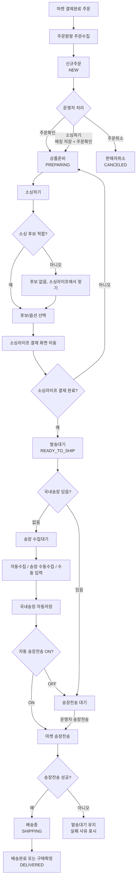
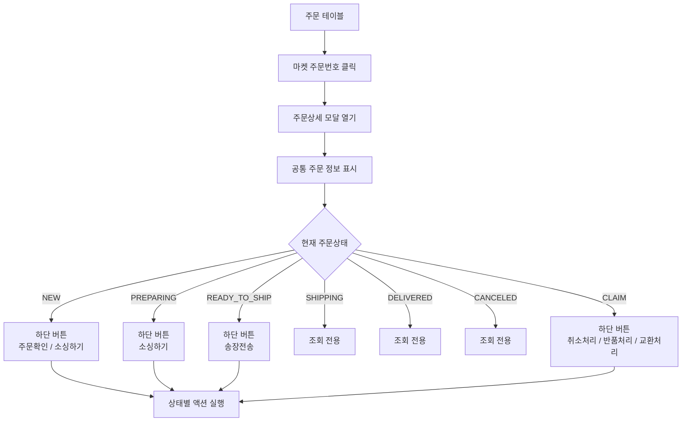
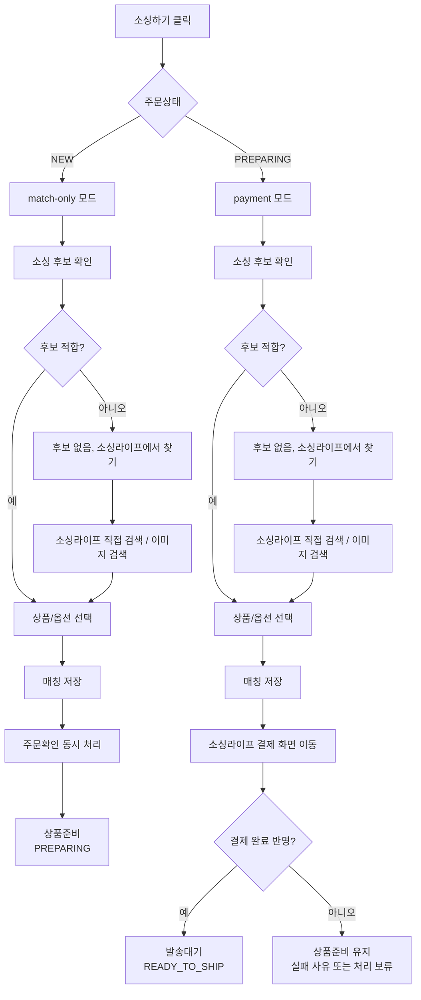
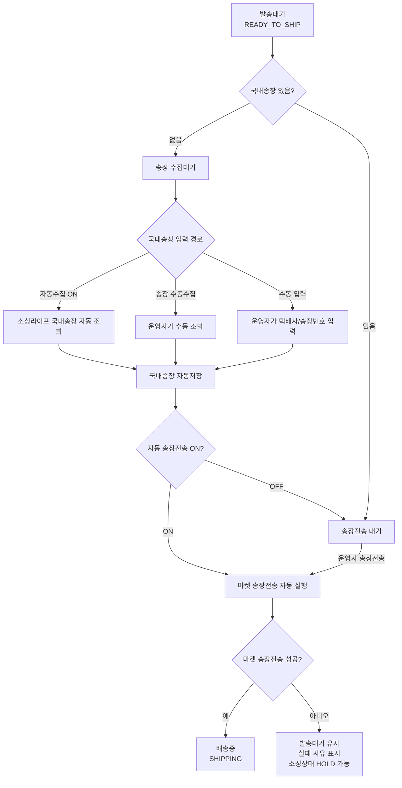
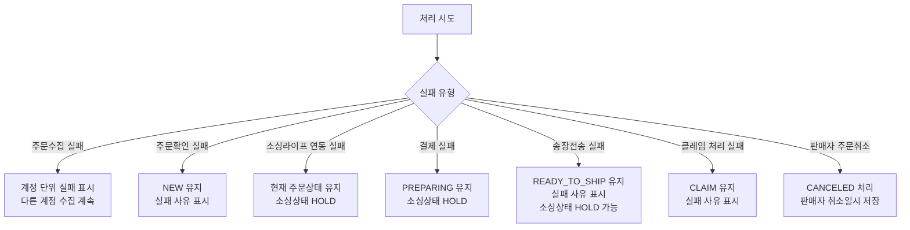

# 주문처리 유저플로우

## 1. 문서 목적

이 문서는 주문팡팡 + 소싱라이프 주문처리 흐름을 시각화하기 위한 기준 문서다.
현재 기준 문서는 `01_서비스기획`, `02_UI_UX_명세서`, `03_기능명세서`, `04_시스템_아키텍처_및_API`, `05_프론트엔드_개발가이드`, `06_운영_및_매뉴얼`, `07_주문팡팡개별`의 내용을 바탕으로 한다.

MD 파일은 유저플로우의 원본 기준 문서이며, HTML 파일은 브라우저 확인용 시각화 산출물이다.

## 2. 유저플로우 작성 범위

이번 문서에서는 주문관리의 핵심 흐름을 우선 시각화한다.

- 전체 주문 처리 흐름
- 주문상세 모달 진입과 상태별 다음 단계 버튼
- 소싱하기 상세 흐름
- 국내송장 수집, 입력, 자동저장, 송장전송 흐름
- 실패와 보류 흐름

## 3. 전체 주문 처리 흐름

## 4. 상태별 운영자 액션

| 주문상태 | 화면 의미 | 주요 액션 | 성공 시 상태 |
|---|---|---|---|
| `NEW` | 신규주문 | `주문확인` | `PREPARING` |
| `NEW` | 신규주문 | `소싱하기` | 매칭 저장 + 주문확인 후 `PREPARING` |
| `NEW` | 신규주문 | `주문취소` | `CANCELED` |
| `PREPARING` | 상품준비 | `소싱하기` | 소싱라이프 결제 완료 후 `READY_TO_SHIP` |
| `READY_TO_SHIP` | 발송대기 | 국내송장 자동수집, 송장 수동수집, 수동 입력 | 국내송장 자동저장 후 `READY_TO_SHIP` 유지 |
| `READY_TO_SHIP` | 발송대기 | `송장전송` | 성공 시 `SHIPPING` |
| `SHIPPING` | 배송중 | 조회 | 배송완료 또는 구매확정 수집 시 `DELIVERED` |
| `DELIVERED` | 배송완료 | 조회 | 상태 유지 |
| `CANCELED` | 판매자취소 | 조회 | 상태 유지 |
| `CLAIM` | 취소/반품/교환 | `취소처리` / `반품처리` / `교환처리` | 유형별 클레임 처리 |

## 5. 주문상세 모달 흐름

마켓 주문번호를 클릭하면 주문상세 모달을 연다.
모달은 공통 주문 정보를 보여주고, 하단에는 현재 주문상태에서 가능한 다음 단계 버튼만 표시한다.

주문취소는 신규주문 테이블 행 액션으로 제공하며, 주문상세 모달 하단 버튼에는 표시하지 않는다.

## 6. 소싱하기 상세 흐름

`소싱하기`는 `NEW`와 `PREPARING`에서 동작 범위가 다르다.

## 7. 국내송장과 송장전송 흐름

국내송장은 `READY_TO_SHIP` 상태에서만 입력 또는 수집할 수 있다.
자동수집과 자동 송장전송은 서로 다른 기능이다.

## 8. 실패와 보류 흐름

## 9. 화면 전환 기준

| 출발 화면 | 사용자 행동 | 도착 화면 또는 결과 |
|---|---|---|
| 주문수집 > 전체 | 좌측 상태 메뉴 선택 | 선택한 상태 목록 |
| 주문수집 > 신규주문 | `주문확인` | 상품준비 |
| 주문수집 > 신규주문 | `소싱하기` | 소싱하기 모달 |
| 주문수집 > 상품준비 | `소싱하기` | 소싱하기 모달, 소싱라이프 결제 화면 |
| 주문수집 > 발송대기 | `송장 수동수집` | 소싱라이프 국내송장 조회 후 자동저장 |
| 주문수집 > 발송대기 | 국내송장 수동 입력 | 자동저장 |
| 주문수집 > 발송대기 | `송장전송` | 성공 시 배송중 |
| 주문 테이블 | 마켓 주문번호 클릭 | 주문상세 모달 |
| 주문 테이블 | 상품이미지 클릭 | 이미지 크게 보기 |
| 주문 테이블 | 상품명 클릭 | 오픈마켓 상품 상세 |

## 10. 다음 작업 기준

이 유저플로우를 기준으로 다음 산출물을 작성한다.

1. 주문수집 IA와 화면 구조
2. 주문수집 메인 화면 와이어프레임
3. 주문상세 모달 와이어프레임
4. 소싱하기 모달 와이어프레임
5. 발송대기 송장 처리 영역 와이어프레임
