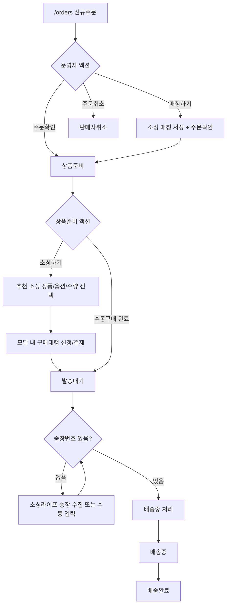
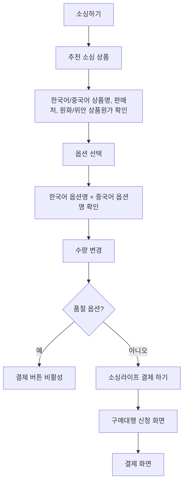
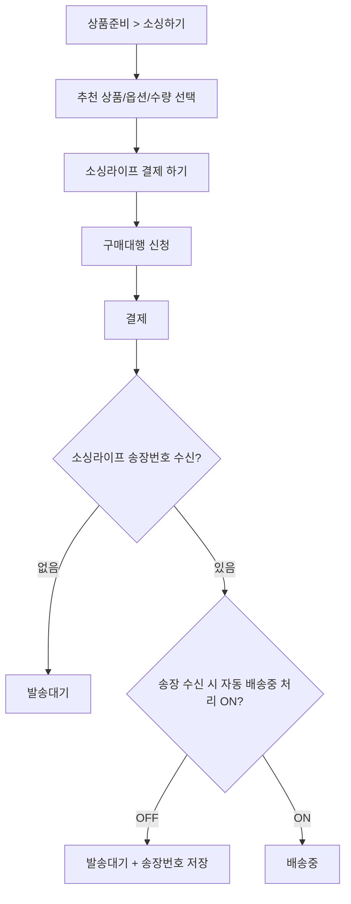
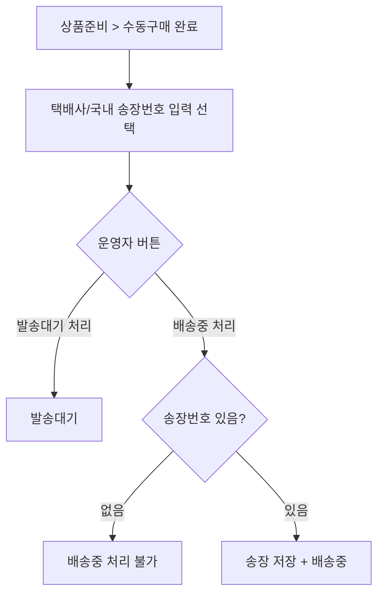
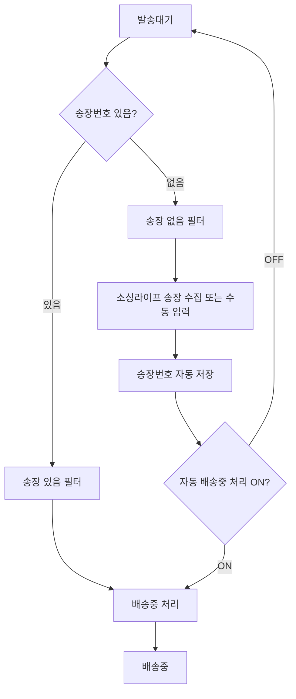

# 주문처리 유저플로우

## 1. 기본 흐름

## 2. 상태별 사용자 액션

| 상태 | 화면 | 사용자 액션 | 결과 |
|---|---|---|---|
| `NEW` | 신규주문 | `주문확인` | `PREPARING` |
| `NEW` | 신규주문 | `매칭하기` | 매칭 저장 + 주문확인 후 `PREPARING` |
| `NEW` | 신규주문 | `주문취소` | `CANCELED` |
| `PREPARING` | 상품준비 | `소싱하기` | 구매대행 신청/결제 후 `READY_TO_SHIP` 또는 조건부 `SHIPPING` |
| `PREPARING` | 상품준비 | `수동구매 완료` | 발송대기 처리 또는 배송중 처리 |
| `READY_TO_SHIP` | 발송대기 | `소싱라이프 송장 수집` | 송장번호 저장 |
| `READY_TO_SHIP` | 발송대기 | `배송중 처리` | 송장번호가 있으면 `SHIPPING` |
| `CLAIM` | 취소/반품/교환 | `취소처리`, `반품처리`, `교환처리` | 클레임 처리 |

## 3. 소싱하기 상세 흐름

신규주문에서의 버튼명은 `매칭하기`, 상품준비에서의 버튼명은 `소싱하기`다.

## 4. 소싱 결제 결과 분기

소싱라이프 결제가 완료되어도 송장번호가 없으면 발송대기에 남는다.
송장번호가 함께 들어온 경우 자동 처리 설정에 따라 발송대기에 저장하거나 배송중으로 이동한다.

## 5. 수동구매 완료 분기

`발송대기 처리`는 송장번호가 없어도 가능하다.
송장번호를 입력한 뒤 `발송대기 처리`를 누르면 송장번호만 저장된 상태로 발송대기에 남고, `배송중 처리`를 누르면 저장과 함께 배송중으로 이동한다.

## 6. 송장/배송 흐름

`소싱라이프 송장 자동 수집`은 송장을 가져오는 기능이고, `자동 배송중 처리`는 송장 입력 이후 배송중 전환을 자동 시도하는 기능이다.

송장 수집과 배송중 처리는 체크된 주문이 있으면 체크된 주문을 우선 대상으로 하고, 체크된 주문이 없으면 현재 필터로 보이는 주문을 대상으로 한다.
송장 수집은 소싱라이프 주문번호가 있고 국내 송장번호가 없는 주문만 처리한다.
배송중 처리는 국내 송장번호가 있는 주문만 처리한다.

## 7. 화면 이동

| 출발 | 행동 | 도착 또는 결과 |
|---|---|---|
| 주문수집 | 상단 탭 선택 | 신규주문, 상품준비, 발송대기, 배송중, 배송완료 |
| 신규주문 | `매칭하기` | 소싱 매칭 모달 |
| 상품준비 | `소싱하기` | 소싱/구매대행/결제 모달 |
| 발송대기 | `배송중 처리` | 배송중 |
| 소싱라이프 주문번호 클릭 | 링크 클릭 | 임시 소싱라이프 주문상세 새 탭 |
