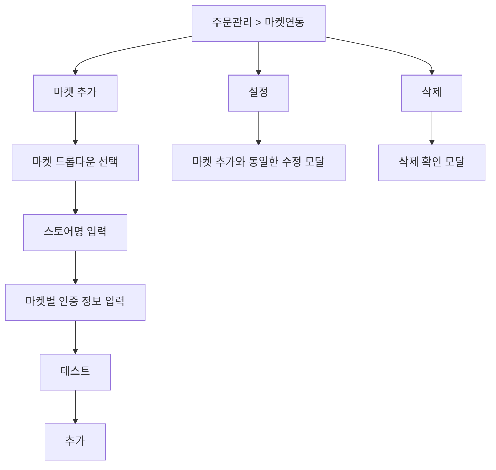
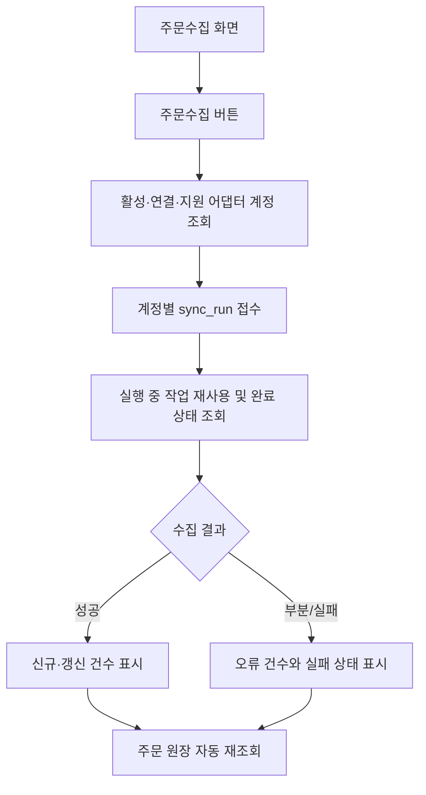
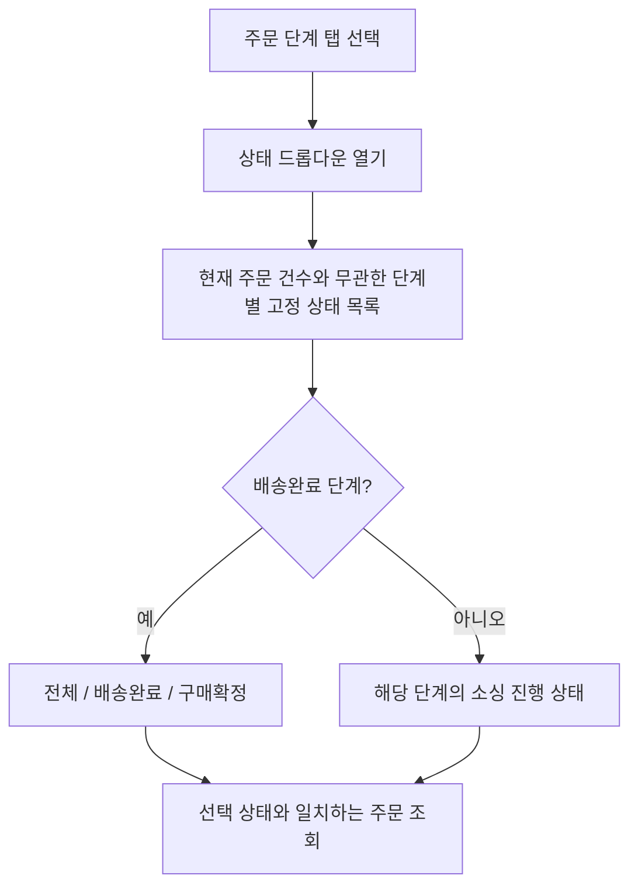
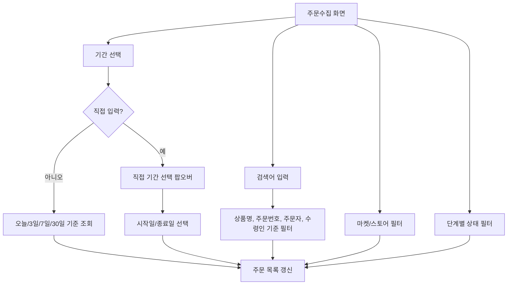
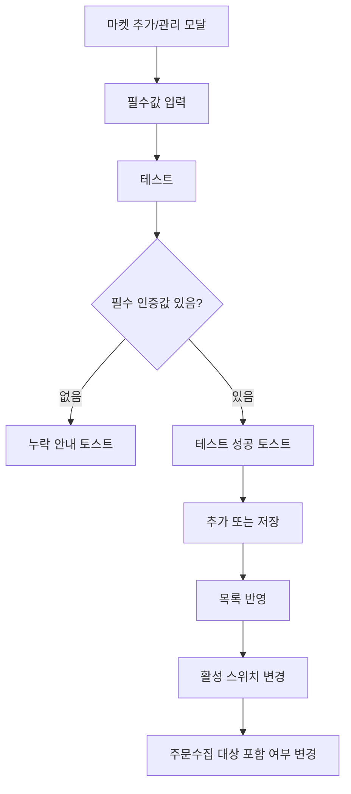

# 마켓연동 및 주문수집 유저플로우

## 1. 마켓연동 흐름

## 2. 마켓 추가 드롭다운

- 스마트스토어
- 쿠팡
- 11번가
- G마켓
- 옥션

## 3. 목록 컬럼

| 컬럼 | 설명 |
|---|---|
| 마켓 | 스마트스토어, 쿠팡, 11번가, G마켓, 옥션 |
| 스토어명 | 사용자가 구분하기 위해 입력한 이름 |
| 연동상태 | 정상, 오류 등 현재 상태 |
| 활성 | 주문수집 대상 포함 여부 |
| 관리 | 수정, 삭제 |

현재 MVP 화면에서는 플랫폼 수수료율, 마지막 수집, 결과, 판매자 계정명 컬럼을 표시하지 않는다.

## 4. 주문수집 흐름

마켓/스토어 필터는 주문 목록 조회 조건이다.
필터를 변경해도 주문수집 실행 대상은 바뀌지 않는다.
현재 생산 주문수집 대상은 스마트스토어다. 쿠팡·11번가·ESM은 각 어댑터 worker와 실계정 UAT가 완료된 뒤 같은 흐름에 편입한다.
데모 주문의 기준시각은 기본 7일 조회 범위 안으로 유지해 API 자격증명 없이도 신규주문과 예외 주문을 확인할 수 있게 한다.

## 5. 마켓/스토어 필터 흐름

| 선택 상태 | 표시 기준 |
|---|---|
| 아무것도 선택 안 함 | 전체 주문 표시 |
| 마켓만 선택 | 선택한 마켓의 전체 스토어 주문 표시 |
| 스토어만 선택 | 해당 스토어 주문 표시 |
| 마켓 + 스토어 선택 | 선택한 마켓 안에서 선택한 스토어 주문만 표시 |

선택한 마켓과 관계없는 스토어는 숨기지 않고 비활성화한다.

## 5-1. 단계별 상태 필터 흐름

배송완료 주문은 모두 `배송완료` 상태값을 가지며, `marketOrderStatus`가 `PURCHASE_DECIDED`이면 `구매확정` 상태값을 추가로 가진다.
따라서 구매확정 주문은 `배송완료` 필터에도 포함되고, `구매확정` 필터로 별도 조회할 수 있다. 내부 주문 단계는 `DELIVERED`를 유지한다.

## 6. 검색/기간 필터 흐름

기간, 검색어, 마켓/스토어, 단계별 상태 필터는 모두 현재 화면의 주문 목록을 좁히는 조회 조건이다.
`주문수집` 버튼은 우측에 고정되며, 필터 조건 입력과 별도로 활성 계정 기준 수집을 실행한다.

## 7. 마켓연동 검증/활성 흐름

마켓 추가의 `추가` 버튼은 현재 선택한 마켓의 필수 인증 정보가 채워져야 사용할 수 있다.
`설정`은 마켓 추가와 동일한 계정 수정 모달을 사용하되 마켓 종류는 변경하지 않는다.
`활성` 스위치는 계정을 삭제하지 않고 주문수집 대상 포함 여부만 바꾼다.
