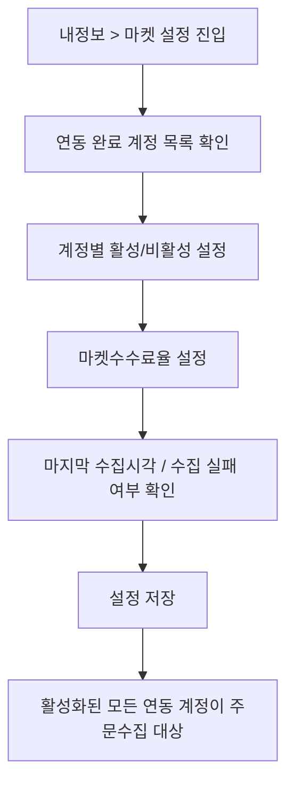
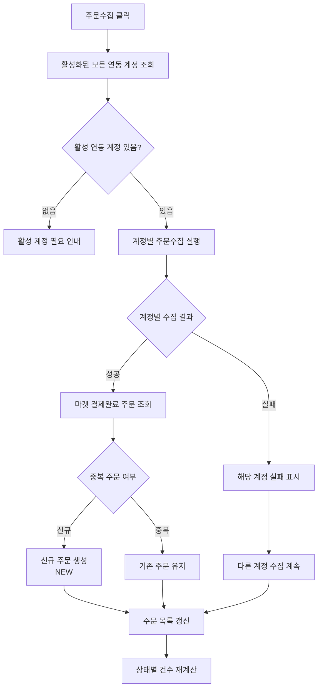
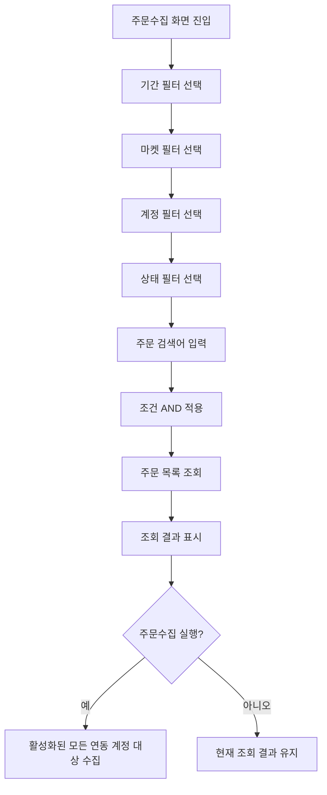

# 마켓 설정 및 주문수집 유저플로우

## 1. 문서 목적

이 문서는 주문팡팡에서 주문수집을 실행하기 전 필요한 마켓 설정, 주문수집 실행, 검색/필터 흐름을 시각화하기 위한 기준 문서다.
MD 파일은 유저플로우의 원본 기준 문서이며, HTML 파일은 브라우저 확인용 시각화 산출물이다.

## 2. 유저플로우 작성 범위

- 마켓 설정 유저플로우
- 주문수집 실행 유저플로우
- 검색/필터 유저플로우

## 3. 마켓 설정 유저플로우

마켓 설정은 `내정보 > 마켓 설정`에서 진행한다.
MVP 화면은 네이버 스마트스토어, 쿠팡, 11번가, 지마켓, 옥션 계정이 모두 연동 완료된 상태를 기준으로 관리한다.

## 4. 마켓 설정 운영 기준

| 항목 | 기준 |
|---|---|
| 진입 위치 | `내정보 > 마켓 설정` |
| 연동 완료 마켓 | 네이버 스마트스토어, 쿠팡, 11번가, 지마켓, 옥션 |
| 등록 단위 | 마켓별 스토어 또는 판매자 계정 |
| 계정 수 제한 | 제한 없음 |
| 계정 상태 | 연동 완료, 수집 성공, 수집 실패 |
| 계정 액션 | 활성/비활성, 설정, 삭제 |
| 수수료 설정 | 마켓 또는 연동 계정 단위 마켓수수료율 |

## 5. 주문수집 실행 유저플로우

주문수집은 활성화된 모든 연동 계정을 대상으로 실행한다.
특정 판매처만 주문수집하거나 특정 계정만 주문수집하는 기능은 초기 범위에 포함하지 않는다.

## 6. 주문수집 결과 기준

| 상황 | 결과 |
|---|---|
| 활성 계정 없음 | 주문수집 전 연동 계정 필요 안내 |
| 계정 인증 성공 | 해당 계정의 결제완료 주문 수집 |
| 계정 인증 실패 | 해당 계정 실패 표시, 다른 계정 수집 계속 |
| 신규 주문 | `NEW` 상태로 생성 |
| 중복 주문 | 기존 주문 유지 |
| 일부 계정 실패 | 전체 실패가 아니라 계정 단위 실패로 표시 |

중복 방지 기준은 `마켓 + 연동 계정 + 마켓 주문번호`와 `마켓 + 연동 계정 + 상품주문번호`를 사용한다.

## 7. 검색/필터 유저플로우

검색/필터는 주문 목록 조회 조건이다.
필터는 조회 조건이며 주문수집 실행 범위를 제한하지 않는다.

## 8. 검색/필터 기준

| 필터 | 기준 |
|---|---|
| 기간 필터 | 시작일, 종료일, 오늘, 7일, 15일, 1개월 |
| 마켓 필터 | 전체, 네이버 스마트스토어, 쿠팡, 11번가, 지마켓, 옥션 |
| 계정 필터 | 전체 계정 또는 등록된 스토어/판매자 계정 |
| 상태 필터 | 전체 메뉴에서는 일반 주문 상태 다중 선택, 개별 메뉴에서는 해당 상태로 제한 |
| 주문 검색 | 마켓 주문번호, 상품주문번호, 상품명, 구매자명, 수령인명, 연락처, 개인통관부호 |

여러 필터를 함께 선택하면 모든 조건을 만족하는 주문만 표시한다.
필터를 변경해도 주문수집 대상 계정은 바뀌지 않는다.

## 9. 다음 작업 기준

이 유저플로우를 기준으로 다음 산출물을 작성한다.

1. 마켓 설정 화면 와이어프레임
2. 주문수집 실행 영역 와이어프레임
3. 검색/필터 영역 와이어프레임
