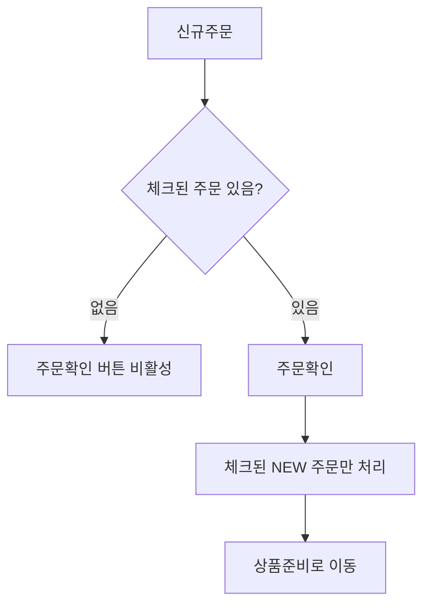
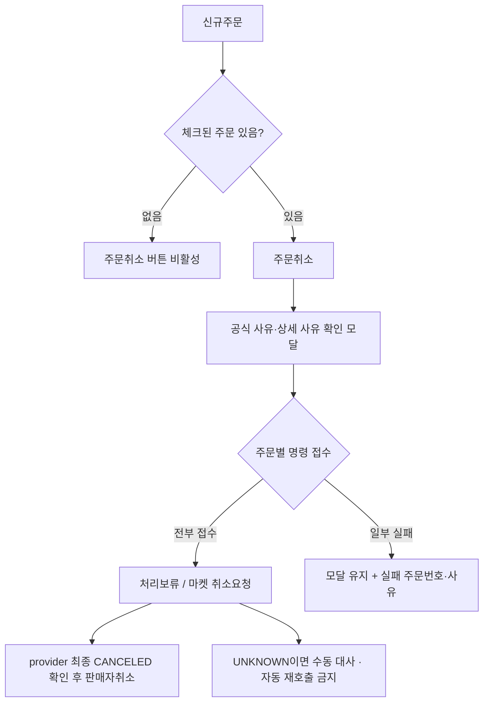
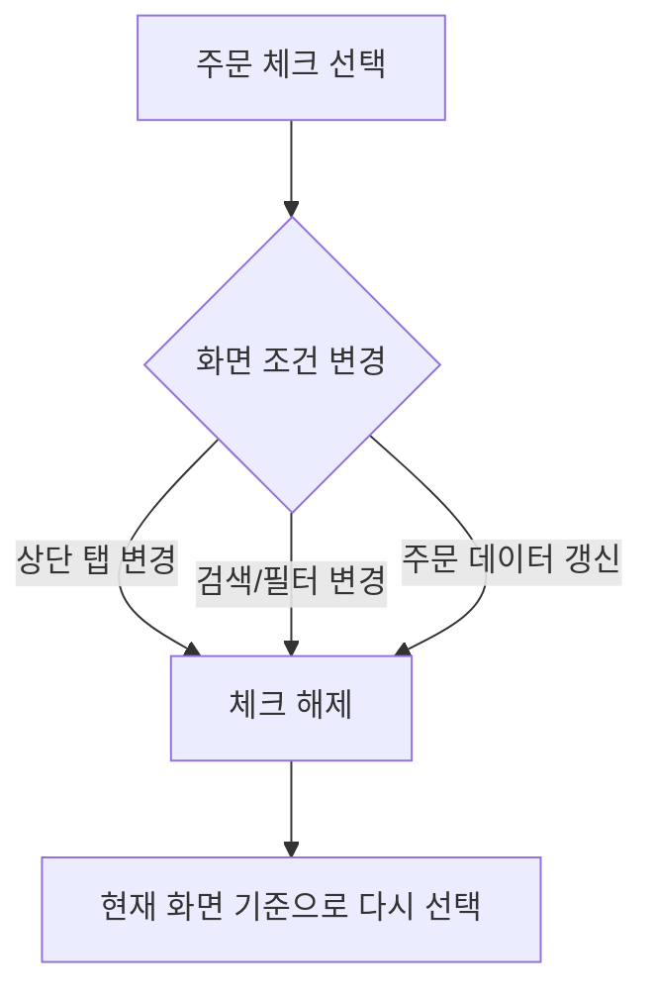
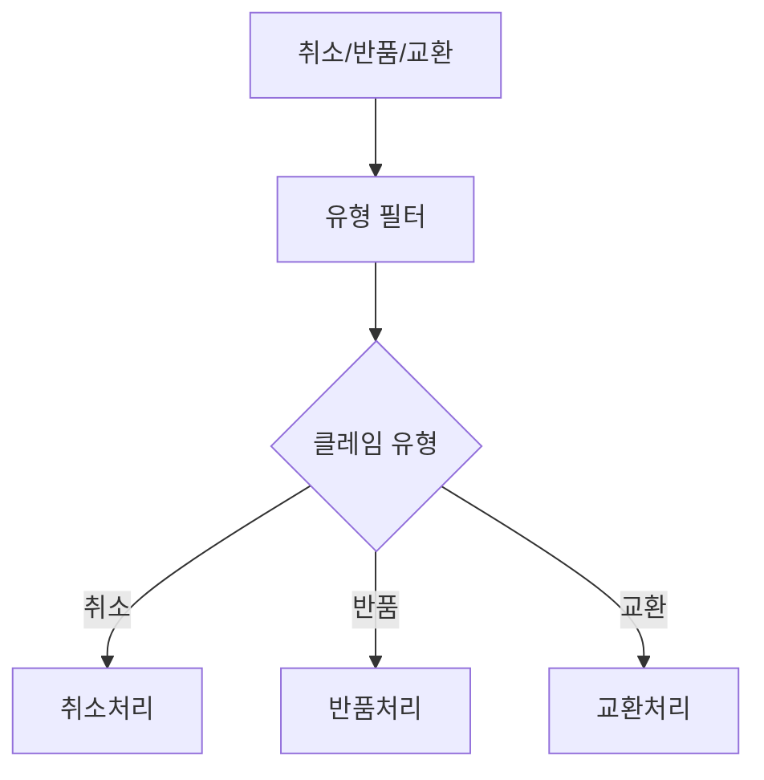
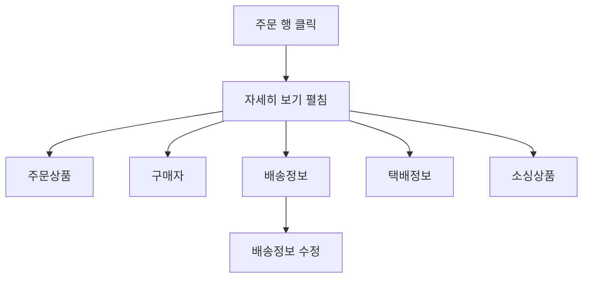
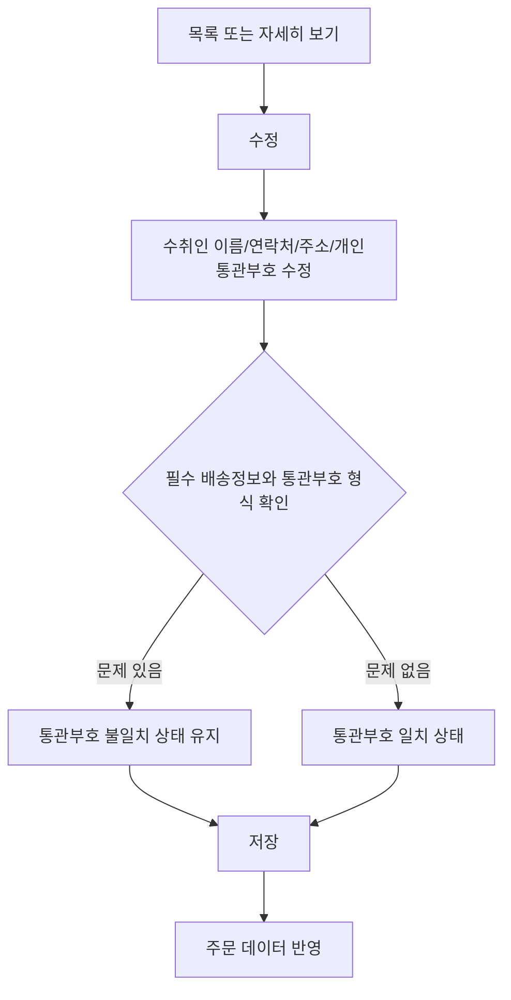
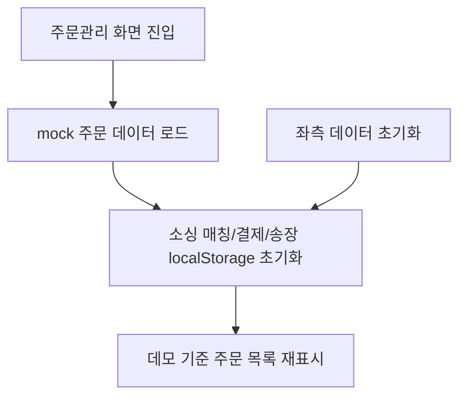

# 주문운영 보조흐름 유저플로우

## 1. 일괄 주문확인

상단 `주문확인`은 체크된 항목만 대상으로 한다.
체크된 주문이 없으면 누를 수 없다.

## 2. 일괄 주문취소

개별 주문취소와 일괄 주문취소 모두 확인 모달을 거친다. 일괄 일부 실패는 성공으로 닫지 않으며 같은 멱등키로 실패 주문을 다시 처리한다.

## 3. 선택 상태 초기화 흐름

체크박스 선택은 탭과 필터마다 독립적으로 다뤄지며, 다른 단계로 이동하거나 필터가 바뀌면 이전 선택을 유지하지 않는다.

## 4. 클레임 보조 흐름

현재 MVP의 취소/반품/교환 화면에는 현재단계 필터를 제공하지 않는다.
취소 클레임은 `취소처리`에서 승인 또는 거부를 선택할 수 있다.
반품/교환은 현재 MVP에서 사유와 진행 상태를 확인하는 조회 중심 화면으로 제공한다.

## 5. 자세히 보기 흐름

목록 컬럼은 처리에 필요한 최소 정보만 표시하고, 상세 정보는 행 확장으로 확인한다.

## 6. 배송정보 수정 흐름

배송정보는 목록의 `수정` 버튼과 행 확장 상세에서 수정할 수 있다.
개인통관부호는 일치/불일치 여부와 관계없이 운영자가 다시 수정할 수 있다.

## 7. 데모 데이터 초기화 흐름

현재 MVP는 백엔드 없이 mock 데이터와 브라우저 저장소를 사용하는 데모 구현이다.
주문관리 화면 진입 또는 임시 데이터 초기화 버튼으로 데모 상태를 다시 맞춘다.
