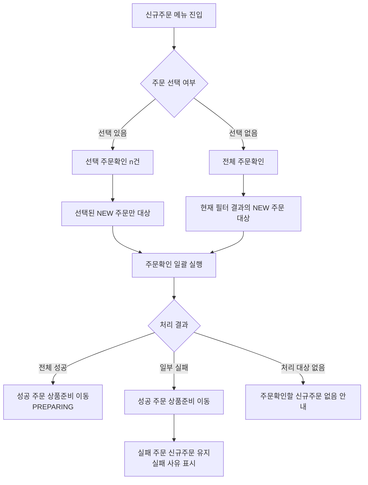
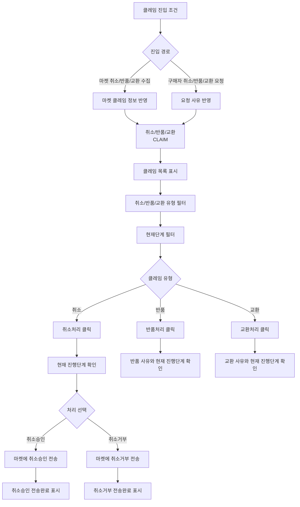
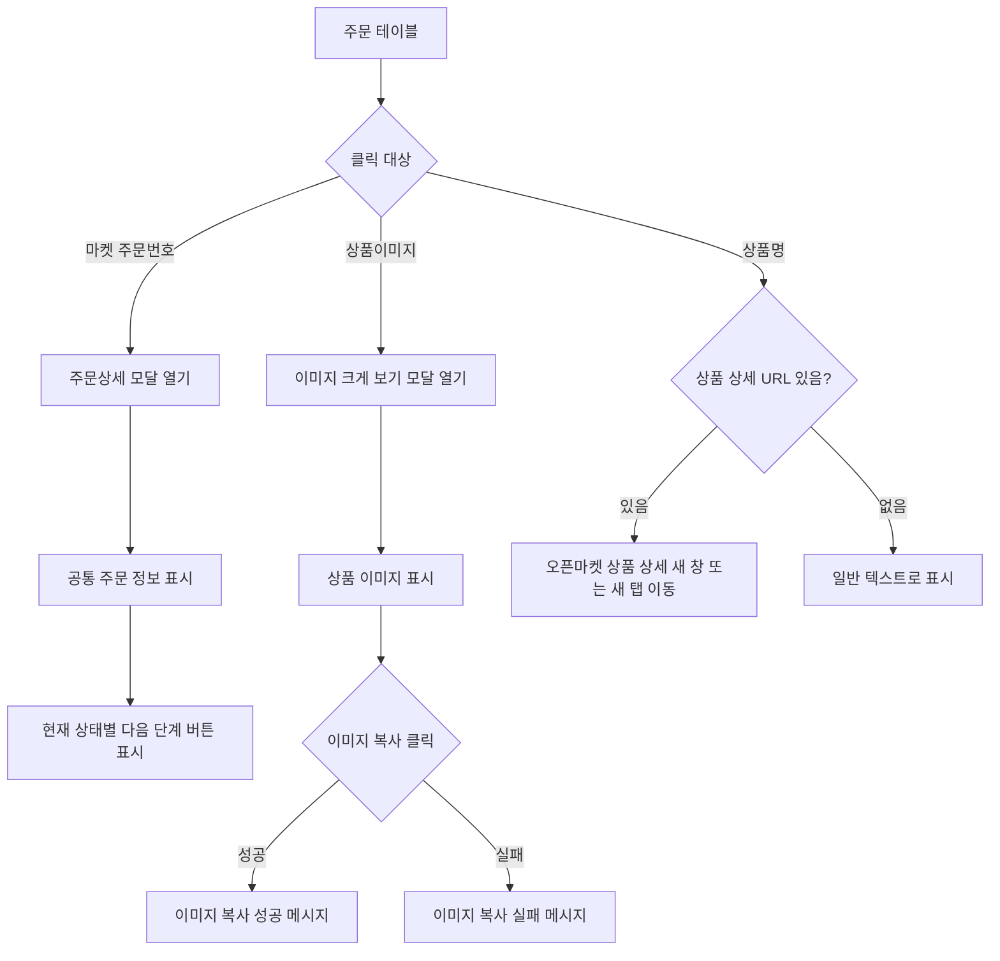

# 주문운영 보조흐름 유저플로우

## 1. 문서 목적

이 문서는 주문팡팡 주문관리에서 주문 처리 흐름을 보조하는 일괄처리, 클레임, 테이블 클릭 인터랙션 흐름을 시각화하기 위한 기준 문서다.
MD 파일은 유저플로우의 원본 기준 문서이며, HTML 파일은 브라우저 확인용 시각화 산출물이다.

## 2. 유저플로우 작성 범위

- 일괄처리 유저플로우
- 클레임 유저플로우
- 이미지/상품명/주문번호 클릭 흐름

## 3. 일괄처리 유저플로우

일괄 주문확인은 `NEW` 상태 주문에만 적용한다.
선택 주문이 있으면 선택 주문을 대상으로 처리하고, 선택 주문이 없으면 현재 필터 결과에 노출된 신규주문을 대상으로 처리한다.

## 4. 일괄처리 기준

| 항목 | 기준 |
|---|---|
| 적용 상태 | `NEW` |
| 선택 주문확인 | 체크한 신규주문 대상 |
| 전체 주문확인 | 현재 필터 결과에 노출된 신규주문 대상 |
| 성공 결과 | `PREPARING`으로 이동 |
| 실패 결과 | `NEW` 유지, 실패 사유 표시 |
| 대상 없음 | 처리할 신규주문 없음 안내 |

## 5. 클레임 유저플로우

클레임은 구매자가 요청했거나 마켓에서 수집된 취소/반품/교환으로 진입한다.
클레임 상태의 주문은 취소/반품/교환 메뉴에서 확인한다.
판매자가 직접 주문취소한 건은 클레임이 아니라 판매자취소 상태로 마감한다.

## 6. 클레임 처리 기준

| 항목 | 기준 |
|---|---|
| 진입 경로 | 구매자 요청, 마켓 취소/반품/교환 수집 |
| 주문상태 | `CLAIM` |
| 표시 위치 | 주문관리 > 취소/반품/교환 |
| 목록 필터 | 클레임 유형(`claimType`)과 현재단계(`previousStatus`) 기준으로 구분 |
| 취소 행 액션 | `취소처리` |
| 반품 행 액션 | `반품처리` |
| 교환 행 액션 | `교환처리` |
| 취소처리 화면 표시 | 현재 진행단계, 클레임 사유, 소싱라이프 주문번호, 소싱상태, 국내송장 |
| 취소 후속 처리 | `취소승인` 또는 `취소거부`를 마켓에 전송 |
| 반품/교환 후속 처리 | 사유와 진행단계 확인, 승인/회수/재발송은 별도 클레임 관리 확장 대상 |

## 6-1. 판매자 직접 주문취소 기준

판매자가 직접 주문취소한 건은 구매자 요청 클레임이 아니므로 취소/반품/교환 메뉴에 노출하지 않는다.

| 항목 | 기준 |
|---|---|
| 진입 경로 | 일반 주문 목록의 `주문취소` |
| 주문상태 | `CANCELED` |
| 표시 위치 | 전체 주문 조회에서 조회 전용 |
| 저장 정보 | 판매자 취소 사유, 판매자 취소일시 |

## 7. 이미지/상품명/주문번호 클릭 흐름

주문 테이블의 클릭 인터랙션은 각 컬럼의 업무 목적에 맞게 동작한다.

## 8. 클릭 인터랙션 기준

| 클릭 대상 | 결과 |
|---|---|
| 마켓 주문번호 | 주문상세 모달 열기 |
| 상품이미지 | 이미지 크게 보기 모달 열기 |
| 이미지 복사 | 현재 표시 중인 상품 이미지를 클립보드에 복사 |
| 상품명 | 오픈마켓 상품 상세 페이지 이동 |
| 상품 상세 URL 없음 | 상품명을 일반 텍스트로 표시 |

주문상세 모달 하단에는 현재 주문 상태에서 가능한 다음 단계 버튼만 표시한다.
주문취소는 신규주문 테이블 행 액션으로 제공하며 주문상세 모달 하단 버튼에는 표시하지 않는다.

## 9. 다음 작업 기준

이 유저플로우를 기준으로 다음 산출물을 작성한다.

1. 신규주문 일괄처리 와이어프레임
2. 취소/반품/교환 처리 모달 와이어프레임
3. 이미지 크게 보기 모달 와이어프레임
4. 주문상세 모달 세부 와이어프레임
